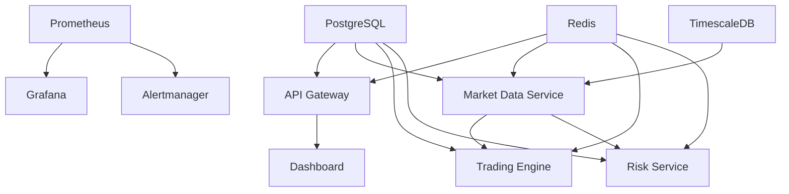

# Alpha Discovery Deployment Guide

This document provides comprehensive instructions for deploying the Alpha Discovery algorithmic trading platform with the new **GPU-optimized ML architecture**.

## 🚀 **NEW: GPU-Accelerated ML Architecture**

As of 2025, Alpha Discovery now uses a **distributed ML architecture** where all heavy machine learning models run on a dedicated GPU server (RunPod), while the main application services remain lightweight and fast. This dramatically improves performance and reduces costs.

**Key Benefits:**
- ⚡ **10x faster startup times** for main application services
- 💰 **Significant cost savings** - only pay for GPU when doing ML inference
- 🔧 **Better scalability** - scale ML and application services independently
- 🎯 **State-of-the-art models** - All 2025 SOTA models (GLiNER, XGBoost, LightGBM, CatBoost, Stable-Baselines3 RL)

## 📋 Table of Contents

- [Prerequisites](#prerequisites)
- [🆕 RunPod GPU Deployment](#runpod-gpu-deployment)
- [Quick Start](#quick-start)
- [Deployment Types](#deployment-types)
- [Environment Setup](#environment-setup)
- [Docker Configuration](#docker-configuration)
- [Database Setup](#database-setup)
- [Service Configuration](#service-configuration)
- [Monitoring & Logging](#monitoring--logging)
- [Blue-Green Deployment](#blue-green-deployment)
- [Health Checks](#health-checks)
- [Troubleshooting](#troubleshooting)
- [Rollback Procedures](#rollback-procedures)
- [Maintenance](#maintenance)

## 🔧 Prerequisites

### System Requirements

- **OS**: Ubuntu 20.04+ or CentOS 8+
- **CPU**: 8+ cores (16+ recommended for production)
- **RAM**: 16GB+ (32GB+ recommended for production)
- **Storage**: 100GB+ SSD (500GB+ recommended for production)
- **Network**: Stable internet connection with low latency

### Software Dependencies

- **Docker**: 20.10+
- **Docker Compose**: 2.0+
- **Python**: 3.9+
- **Git**: 2.30+
- **curl**: 7.68+
- **jq**: 1.6+
- **nc (netcat)**: 1.10+

### Installation Commands

```bash
# Ubuntu/Debian
sudo apt update
sudo apt install -y docker.io docker-compose python3 python3-pip git curl jq netcat

# CentOS/RHEL
sudo yum install -y docker docker-compose python3 python3-pip git curl jq nc

# Start Docker service
sudo systemctl start docker
sudo systemctl enable docker

# Add user to docker group
sudo usermod -aG docker $USER
```

## 🆕 RunPod GPU Deployment

**IMPORTANT**: Before deploying the main application, you must first deploy the MCP server to RunPod for GPU-accelerated ML inference.

### Step 1: Deploy MCP Server to RunPod

Follow the detailed guide in **[RUNPOD_DEPLOYMENT.md](./RUNPOD_DEPLOYMENT.md)** to:

1. Set up a RunPod GPU pod (RTX 4090/A5000 recommended)
2. Deploy the MCP server using `Dockerfile.mcp`
3. Get your RunPod public IP and port

### Step 2: Configure Main Application

Once your MCP server is running on RunPod, configure your main application:

```bash
# Set the MCP server URL in your environment
export MCP_SERVER_URL="http://your-runpod-ip:8002"

# Add to your .env file
echo "MCP_SERVER_URL=http://your-runpod-ip:8002" >> .env
```

### Step 3: Deploy Main Application

Use the new production Docker Compose file that excludes the MCP server:

```bash
# Deploy main services (without MCP server)
docker-compose -f docker-compose.production.yml up -d
```

## 🚀 Quick Start

### 1. Clone Repository

```bash
git clone https://github.com/your-org/alpha-discovery.git
cd alpha-discovery
```

### 2. Set Environment Variables

```bash
# Copy environment template
cp configs/env.template .env

# Edit environment variables
nano .env
```

### 3. Deploy (Development)

```bash
# Make deployment script executable
chmod +x deploy.sh

# Run deployment
./deploy.sh -e development deploy
```

### 4. Deploy (Production)

```bash
# Production deployment with blue-green
./deploy.sh -e production -t blue-green deploy
```

## 📦 Deployment Types

### Rolling Deployment (Default)

Rolling deployment updates services one by one without downtime.

```bash
./deploy.sh -e production -t rolling deploy
```

**Characteristics:**
- ✅ No downtime
- ✅ Gradual rollout
- ✅ Easy rollback
- ⚠️ Mixed versions during deployment

### Blue-Green Deployment

Blue-green deployment maintains two identical environments and switches traffic between them.

```bash
./deploy.sh -e production -t blue-green deploy
```

**Characteristics:**
- ✅ Zero downtime
- ✅ Instant rollback
- ✅ Full testing before switch
- ⚠️ Requires 2x resources

### Canary Deployment

Canary deployment gradually shifts traffic to the new version.

```bash
./deploy.sh -e production -t canary deploy
```

**Characteristics:**
- ✅ Risk mitigation
- ✅ Performance monitoring
- ✅ Gradual rollout
- ⚠️ Complex configuration

## 🌍 Environment Setup

### Development Environment

```bash
# Development-specific settings
export ENVIRONMENT=development
export DOCKER_TAG=dev
export ENABLE_DEBUG=true
export LOG_LEVEL=DEBUG
```

### Staging Environment

```bash
# Staging-specific settings
export ENVIRONMENT=staging
export DOCKER_TAG=staging
export ENABLE_DEBUG=false
export LOG_LEVEL=INFO
```

### Production Environment

```bash
# Production-specific settings
export ENVIRONMENT=production
export DOCKER_TAG=latest
export ENABLE_DEBUG=false
export LOG_LEVEL=WARNING
```

### Required Environment Variables

```bash
# Database
export POSTGRES_PASSWORD=your_secure_password
export REDIS_PASSWORD=your_secure_password
export TIMESCALE_PASSWORD=your_secure_password

# Security
export JWT_SECRET_KEY=your_jwt_secret_key
export API_SECRET_KEY=your_api_secret_key

# External APIs
export ALPHA_VANTAGE_API_KEY=your_api_key
export NASDAQ_API_KEY=your_api_key
export REDDIT_CLIENT_ID=your_client_id
export REDDIT_CLIENT_SECRET=your_client_secret

# Notifications
export SLACK_WEBHOOK_URL=your_slack_webhook
export SMTP_PASSWORD=your_smtp_password
```

## 🐳 Docker Configuration

### Docker Compose Files

- `docker/docker-compose.production.yml` - Production services
- `docker/docker-compose.development.yml` - Development services
- `docker/docker-compose.monitoring.yml` - Monitoring stack

### Service Architecture

```
┌─────────────────┐    ┌─────────────────┐    ┌─────────────────┐
│   Load Balancer │    │   API Gateway   │    │   Dashboard     │
│    (Nginx)      │────│   (FastAPI)     │────│  (Streamlit)    │
└─────────────────┘    └─────────────────┘    └─────────────────┘
                                │
                    ┌───────────┼───────────┐
                    │           │           │
            ┌───────▼───┐ ┌─────▼─────┐ ┌──▼──────┐
            │ Market    │ │ Trading   │ │ Risk    │
            │ Data      │ │ Engine    │ │ Service │
            │ Service   │ │           │ │         │
            └───────────┘ └───────────┘ └─────────┘
                    │           │           │
                    └───────────┼───────────┘
                                │
                    ┌───────────▼───────────┐
                    │     Databases         │
                    │ PostgreSQL │ Redis   │
                    │ TimescaleDB│         │
                    └───────────────────────┘
```

### Resource Allocation

| Service | CPU | Memory | Storage |
|---------|-----|--------|---------|
| API Gateway | 0.5 | 1GB | - |
| Trading Engine | 1.0 | 2GB | - |
| Market Data | 1.0 | 2GB | - |
| Risk Service | 0.5 | 1GB | - |
| Dashboard | 0.5 | 1GB | - |
| PostgreSQL | 1.0 | 2GB | 50GB |
| Redis | 0.5 | 1GB | 10GB |
| TimescaleDB | 2.0 | 4GB | 100GB |

## 🗄️ Database Setup

### PostgreSQL Setup

```bash
# Create database
docker exec -it alpha-discovery-postgres createdb -U postgres alpha_discovery

# Run migrations
docker run --rm --network alpha-discovery_default \
  -e POSTGRES_HOST=postgres \
  -e POSTGRES_PASSWORD=$POSTGRES_PASSWORD \
  alpha-discovery-base:latest \
  python migrations/run_migrations.py
```

### TimescaleDB Setup

```bash
# Create TimescaleDB database
docker exec -it alpha-discovery-timescaledb createdb -U timescale market_data

# Setup TimescaleDB extension
docker exec -it alpha-discovery-timescaledb psql -U timescale -d market_data -c "CREATE EXTENSION IF NOT EXISTS timescaledb;"
```

### Redis Setup

```bash
# Test Redis connection
docker exec -it alpha-discovery-redis redis-cli -a $REDIS_PASSWORD ping

# Set initial configuration
docker exec -it alpha-discovery-redis redis-cli -a $REDIS_PASSWORD config set save "900 1 300 10 60 10000"
```

## ⚙️ Service Configuration

### Service Dependencies



### Service Startup Order

1. **Infrastructure Services**
   - PostgreSQL
   - Redis
   - TimescaleDB

2. **Core Services**
   - Market Data Service
   - Trading Engine
   - Risk Service
   - Sentiment Service

3. **Frontend Services**
   - API Gateway
   - Dashboard

4. **Monitoring Services**
   - Prometheus
   - Grafana
   - Alertmanager

### Health Check Endpoints

| Service | Endpoint | Expected Response |
|---------|----------|-------------------|
| API Gateway | `GET /health` | `{"status": "healthy"}` |
| Dashboard | `GET /_stcore/health` | `200 OK` |
| Market Data | `GET /health` | `{"status": "healthy"}` |
| Trading Engine | `GET /health` | `{"status": "healthy"}` |
| Risk Service | `GET /health` | `{"status": "healthy"}` |
| Prometheus | `GET /-/healthy` | `200 OK` |
| Grafana | `GET /api/health` | `{"status": "ok"}` |

## 📊 Monitoring & Logging

### Monitoring Stack

- **Prometheus**: Metrics collection
- **Grafana**: Visualization and dashboards
- **Alertmanager**: Alert routing and management
- **Node Exporter**: System metrics
- **cAdvisor**: Container metrics

### Log Aggregation

- **Fluentd**: Log collection and forwarding
- **Elasticsearch**: Log storage and indexing
- **Kibana**: Log visualization and analysis

### Key Metrics to Monitor

#### Application Metrics
- Request rate and latency
- Error rates
- Trading volume and P&L
- Risk metrics (VaR, drawdown)
- Market data feed latency

#### Infrastructure Metrics
- CPU, memory, disk usage
- Network I/O
- Database performance
- Container health

#### Business Metrics
- Active strategies
- Portfolio performance
- Trade execution success rate
- Risk limit utilization

### Alerting Rules

```yaml
# Critical Alerts
- alert: ServiceDown
  expr: up == 0
  for: 1m
  labels:
    severity: critical

- alert: HighErrorRate
  expr: rate(http_requests_total{status=~"5.."}[5m]) > 0.1
  for: 2m
  labels:
    severity: warning

- alert: TradingEngineDown
  expr: up{job="trading-engine"} == 0
  for: 30s
  labels:
    severity: critical
```

## 🔄 Blue-Green Deployment

### Setup Blue-Green Environment

```bash
# Initialize blue-green deployment
./deploy.sh -e production -t blue-green deploy

# Check current slot
curl -s http://localhost:8000/health | jq '.slot'
```

### Traffic Switching

```bash
# Switch from blue to green
./deploy.sh -e production -t blue-green --target-slot green deploy

# Verify traffic switch
curl -s http://api.alphadiscovery.com/health | jq '.slot'
```

### Rollback Process

```bash
# Immediate rollback
./deploy.sh rollback

# Manual traffic switch
./deploy.sh -e production -t blue-green --target-slot blue deploy
```

## 🏥 Health Checks

### Automated Health Checks

```bash
# Run all health checks
python scripts/health_check.py

# Check specific service
python scripts/health_check.py --service postgres

# Continuous monitoring
python scripts/health_check.py --continuous --interval 60
```

### Manual Health Verification

```bash
# Database connectivity
docker exec alpha-discovery-postgres pg_isready -U postgres

# Redis connectivity
docker exec alpha-discovery-redis redis-cli -a $REDIS_PASSWORD ping

# Service endpoints
curl -f http://localhost:8000/health
curl -f http://localhost:8501/_stcore/health
```

### Health Check Automation

```bash
# Add to crontab for regular checks
echo "*/5 * * * * /opt/alpha-discovery/scripts/health_check.py --output /var/log/health.json" | crontab -
```

## 🐛 Troubleshooting

### Common Issues

#### 1. Database Connection Failed

```bash
# Check database status
docker logs alpha-discovery-postgres

# Verify connection parameters
docker exec alpha-discovery-postgres pg_isready -U postgres -h localhost

# Reset database connection
docker restart alpha-discovery-postgres
```

#### 2. Service Not Starting

```bash
# Check service logs
docker logs alpha-discovery-api-gateway

# Verify dependencies
docker ps | grep alpha-discovery

# Check resource usage
docker stats alpha-discovery-api-gateway
```

#### 3. High Memory Usage

```bash
# Monitor memory usage
docker stats --no-stream

# Identify memory leaks
docker exec alpha-discovery-api-gateway ps aux --sort=-%mem

# Restart service if needed
docker restart alpha-discovery-api-gateway
```

#### 4. Network Issues

```bash
# Check network connectivity
docker network ls
docker network inspect alpha-discovery_default

# Test service communication
docker exec alpha-discovery-api-gateway curl -f http://market-data-service:8001/health
```

### Log Analysis

```bash
# View service logs
docker logs -f alpha-discovery-api-gateway

# Search for errors
docker logs alpha-discovery-api-gateway 2>&1 | grep -i error

# Export logs for analysis
docker logs alpha-discovery-api-gateway > api-gateway.log
```

### Performance Debugging

```bash
# Monitor resource usage
htop
iotop
nethogs

# Database performance
docker exec alpha-discovery-postgres psql -U postgres -c "SELECT * FROM pg_stat_activity;"

# Redis performance
docker exec alpha-discovery-redis redis-cli -a $REDIS_PASSWORD info stats
```

## 🔄 Rollback Procedures

### Automatic Rollback

The deployment script includes automatic rollback on failure:

```bash
# Rollback is triggered automatically on:
# - Health check failures
# - Service startup failures
# - Database migration failures
```

### Manual Rollback

```bash
# Rollback to previous deployment
./deploy.sh rollback

# Rollback to specific snapshot
./deploy.sh rollback --snapshot /var/backups/alpha-discovery/snapshots/20231201-120000
```

### Rollback Verification

```bash
# Verify rollback success
./deploy.sh health-check

# Check service versions
curl -s http://localhost:8000/version

# Verify database state
docker exec alpha-discovery-postgres psql -U postgres -c "SELECT * FROM migration_history ORDER BY applied_at DESC LIMIT 5;"
```

## 🔧 Maintenance

### Regular Maintenance Tasks

#### Daily Tasks
- Monitor system health
- Check log files for errors
- Verify backup completion
- Review trading performance

#### Weekly Tasks
- Update security patches
- Rotate log files
- Database maintenance
- Performance optimization

#### Monthly Tasks
- Update dependencies
- Security audit
- Disaster recovery testing
- Capacity planning

### Backup Procedures

```bash
# Database backup
docker exec alpha-discovery-postgres pg_dump -U postgres alpha_discovery > backup_$(date +%Y%m%d).sql

# Configuration backup
./deploy.sh backup-configs

# Full system backup
tar -czf alpha-discovery-backup-$(date +%Y%m%d).tar.gz \
  configs/ docker/ migrations/ scripts/
```

### Update Procedures

```bash
# Update to latest version
git pull origin main
./deploy.sh -e production build
./deploy.sh -e production deploy

# Update specific service
docker pull alpha-discovery-api:latest
docker-compose up -d api-gateway
```

### Security Maintenance

```bash
# Update system packages
sudo apt update && sudo apt upgrade -y

# Scan for vulnerabilities
docker run --rm -v /var/run/docker.sock:/var/run/docker.sock \
  aquasec/trivy image alpha-discovery-api:latest

# Rotate secrets
./scripts/rotate_secrets.sh
```

## 📞 Support and Escalation

### Support Contacts

- **Primary**: DevOps Team (devops@alphadiscovery.com)
- **Secondary**: Platform Team (platform@alphadiscovery.com)
- **Emergency**: On-call Engineer (oncall@alphadiscovery.com)

### Escalation Matrix

| Severity | Response Time | Escalation |
|----------|---------------|------------|
| Critical | 15 minutes | Immediate |
| High | 1 hour | 2 hours |
| Medium | 4 hours | 8 hours |
| Low | 24 hours | 48 hours |

### Emergency Procedures

1. **Immediate Actions**
   - Stop trading if system integrity is compromised
   - Isolate affected services
   - Notify stakeholders

2. **Assessment**
   - Determine impact scope
   - Identify root cause
   - Estimate recovery time

3. **Recovery**
   - Execute rollback if necessary
   - Implement fixes
   - Verify system stability

4. **Post-Incident**
   - Document incident
   - Conduct post-mortem
   - Implement preventive measures

## 📝 Deployment Checklist

### Pre-Deployment

- [ ] Code review completed
- [ ] Tests passing
- [ ] Configuration validated
- [ ] Database migrations tested
- [ ] Backup created
- [ ] Stakeholders notified

### During Deployment

- [ ] Services started in correct order
- [ ] Health checks passing
- [ ] Monitoring active
- [ ] Logs being collected
- [ ] Performance metrics normal

### Post-Deployment

- [ ] End-to-end tests passing
- [ ] User acceptance testing
- [ ] Performance benchmarks met
- [ ] Monitoring alerts configured
- [ ] Documentation updated
- [ ] Deployment notes recorded

---

For additional support or questions, please contact the DevOps team or refer to the project documentation. 